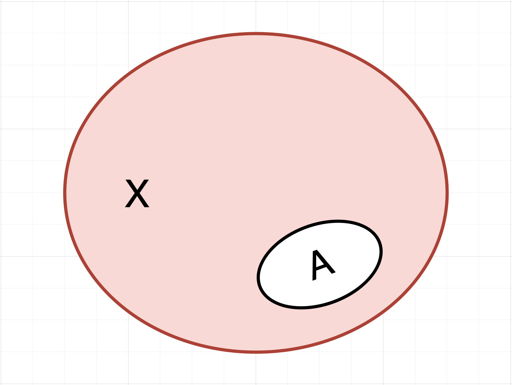
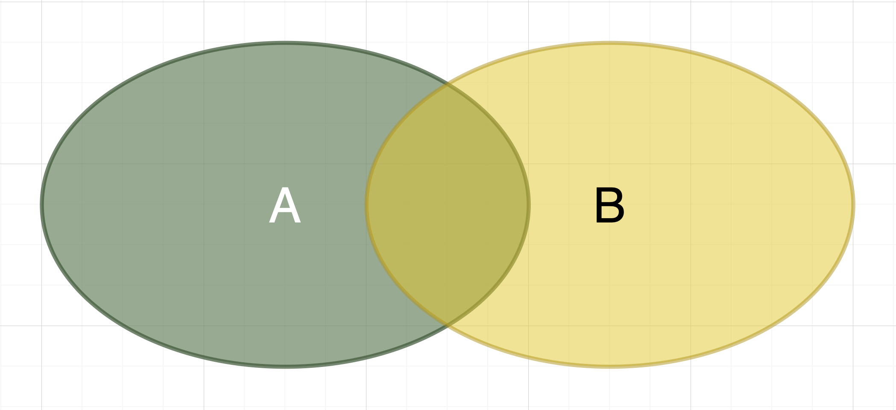

# Lý thuyết tập hợp

> Quay trở lại với những kiến thức cơ bản đã được học ở lớp 6, lớp 7.

---

## Các phép toán trên tập hợp

### Phần bù (phép NOT)

Phần bù của $A$ trong $X$, kí hiệu $\overline{A}$, là tập hợp các phần tử của $X$ không thuộc $A$.

$$\overline{A} = \left\{x \in X : x \notin A \right\}$$

*Minh họa bằng Sơ đồ Venn:*

> *Trong hình vẽ minh họa trên, tập $A$ là tập con của $X$. Khi đó, phần bù của $A$, là tập $\overline{A}$ là phần màu **Hồng** còn những phần màu trăng là tập hợp $A$.*

### Phép hợp

Hợp của $A$ và $B$, kí hiệu $A \cup B$, là tập hợp các phần tử hoặc thuộc vào $A$ hoặc thuộc vào $B$.

$$A \cup B = \left\{x : x \in A \text{ hoặc } x \in B \right\}$$

*Minh họa bằng Sơ đồ Venn:*

> *Trong hình vẽ trên, tập họp $A$ có màu chàm còn tập hợp $B$ có màu vàng, tập hợp $C = A \cup B$ là những phần có màu chàm, màu vàng và phần giữa được tạo bởi hai màu trên.*

### Phép Giao

Giao của $A$ và $B$, kí hiệu $A \cap B$ là tập hợp các phần tử đồng thời thuộc cả $A$ và $B$.

$$A \cap B = \left\{x : x \in A \text{ và } x \in B \right\}$$

*Minh họa bằng Sơ đồ Venn:*

> *Trong hình vẽ trên, tập họp $A$ có màu chàm còn tập hợp $B$ có màu vàng, tập hợp $C = A \cap B$ là phần nằm giữa có màu được tạo bởi màu chàm và màu vàng, không tính những phần chỉ có riêng màu chàm hoặc riêng màu vàng.*

### Phép Hiệu

Hiệu của $A$ và $B$, kí hiệu $A \backslash B$, là tập hợp các phần tử thuộc tập $A$ nhưng không thuộc tập $B$.

$$A \backslash B = \left\{x : x \in A \text{ và } x \notin B \right\}$$

*Minh họa bằng Sơ đồ Venn:*

> *Trong hình vẽ trên, tập họp $A$ có màu chàm còn tập hợp $B$ có màu vàng, tập hợp $C = A \backslash B$ là phần có màu chàm, bỏ đi những phần màu chàm trùng với màu vàng.*

---

## Các tính chất của phép toán trên tập hợp

**1.** Kết hợp

$$
(A \cup B) \cup C = A \cup (B \cup C) \\
(A \cap B) \cap C = A \cap (B \cap C) \\
$$

**2.** Giao hoán

$$
A \cup B = B \cup A \\
A \cap B = B \cap A \\
$$

**3.** Phân bố

$$
A \cup (B \cap C) = (A \cup B) \cap (A \cup C) \\
A \cap (B \cup C) = (A \cap B) \cup (A \cap C) \\
$$

**4.** Đối ngẫu

$$
\overline{A \cup B} = \overline{A} \cap \overline{B} \\
\overline{A \cap B} = \overline{A} \cup \overline{B} \\
$$

---

## Tích Đề-các của các tập hợp

Tích Đề-các ghép hai tập hợp

$$A \times B = \left\{(a, b) | a \in A, b \in B \right\}$$

Tích Đề-các mở rộng ghép nhiều tập hợp

$$A_1 \times A_2 \times \ldots \times A_n = \left\{(a_1, a_2, \ldots, a_n) | a_i \in A_i, i = 1, 2, \ldots, n\right\}$$

---

## Nguyên lí cộng

Nếu $A$ và $B$ là hai tập hợp rời nhau thì

$$|A \cup B| = |A| + |B|$$

***Nguyên lí cộng mở rộng cho nhiều tập hợp đôi một rời nhau:***

Nếu $\left\{A_1, A_2, \ldots, A_k\right\}$ là một phân hoạch của tập $X$ thì:

$$|X| = |A_1| + |A_2| + |A_3| + \ldots + |A_k|$$

---

## Nguyên lí bù trừ

Nếu $A$ và $B$ không rời nhau thì

$$|A \cup B| = |A| + |B| - |A \cap B|$$

***Nguyên lí cộng mở rộng cho nhiều tập hợp:***

Giả sử $A_1, A_2, A_3, \ldots, A_m$ là các tập hợp hữu hạn:

$$|A_1 \cup A_2 \cup A_3 \cup \ldots \cup A_m| = N_1 - N_2 + N_3 + \ldots + (-1)^{m - 1}N_m$$

trong đó $N_k$ là tổng phần tử của tất cả các giao của $k$ tập lấy từ $m$ tập đã cho.

---

## Nguyên lí nhân

Nếu mỗi thành phần $a_i$ của bộ có thứ tự $k$ thành phần $(a_1, a_2, \ldots, a_k)$ có $n_i$ khả năng lựa chọn $(i = 1, 2, \ldots, k)$, thì số bộ sẽ được tạo ra là tích số của các khả năng này $n_1 \times n_2 \times \ldots \times n_k$.

Một hệ quả trực tiếp của nguyên lí nhân:

$$|A_1 \times A_2 \times \ldots \times A_k| = |A_1| \times |A_2| \times \ldots \times |A_k|$$

---

## Chỉnh hợp lặp

Xét một tập hữu hạn gồm $n$ phần tử $\left\{a_1, a_2, a_3, \ldots, a_n\right\}$

Một chỉnh hợp lặp chập $k$ của $n$ phần tử là một bộ có thứ tự gồm $k$ phần tử của $A$, các phần tử có thể lặp lại. Một chỉnh hợp lặp chập $k$ của $n$ có thể xem như một phần tử của tích Đề-các $A^k$. Theo nguyên lí nhân, số tất cả các chỉnh hợp lặp chập $k$ của $n$ sẽ là $n^k$.

$$\overline{A}^k_n = n^k$$

---

## Chỉnh không hợp lặp

Một chỉnh hợp không lặp chập $k$ của $n$ phần tử $(k \le n)$ là một bộ có thứ tự gồm $k$ thành phần lấy từ $n$ phần tử của tập đã cho. Các thành phần không được lặp lại. 

Để xây dựng một chỉnh hợp không lặp, ta xây dựng từng thành phần đầu tiên. Thành phần này có $n$ khả năng lựa chọn. Mỗi thành phần tiếp theo, số lựa chọn khả năng giảm đi $1$ so với thành phần trước đó, do đó, theo nguyên lí nhân, số chỉnh hợp không lặp chập $k$ của $n$ sẽ là $n(n - 1) \ldots (n - k + 1)$.

$$A^k_n = n(n - 1)\ldots(n - k + 1) = \dfrac{n!}{(n - k)!}$$

---

## Hoán vị

Một hoán vị của $n$ phần tử là một cách sắp xếp các thứ tự các phần tử đó. Một hoán vị của $n$ phần tử được xem như một trường hợp riêng của chỉnh hợp không lặp khi $k = n$. Do đó, số hoán vị của $n$ phần tử là $n!$.

---

## Tổ hợp

Một tổ hợp chập $k$ của $n$ phần tử $(k \le n)$ là một bộ không kể thứ tự gồm $k$ thành phần khác nhau lấy từ $n$ phần tử của tập đã cho.

$$C^k_n = \dfrac{n(n - 1)\ldots(n - k + 1)}{k!} = \dfrac{n!}{k!(n - k)!}$$

Một số tính chất:

- $C^k_n = C^{n - k}_n$
- $C^0_n = C^n_n = 1$
- $C^k_n = C^{k - 1}_{n - 1} + C^k_{n - 1} \; (0 < k < n)$

---

## Lời kết

Trên đây là những kiến thức cơ bản liên quan đến tập hợp. Đây là những kiến thức quan trọng trong lập trình nói chung và lập trình thi đấu nói riêng. Cậu hãy chăm chỉ luyện tập và mãi giũa tư duy của mình nhé. Chúc cậu may mắn và gặt hái được nhiều thành công.

---

## Tài liệu tham khảo

- [Lý thuyết tập hợp | Wikipedia](https://vi.wikipedia.org/wiki/L%C3%BD_thuy%E1%BA%BFt_t%E1%BA%ADp_h%E1%BB%A3p).
- [Tập hợp trong toán học | Wikipedia](https://vi.wikipedia.org/wiki/T%E1%BA%ADp_h%E1%BB%A3p_(to%C3%A1n_h%E1%BB%8Dc)).
