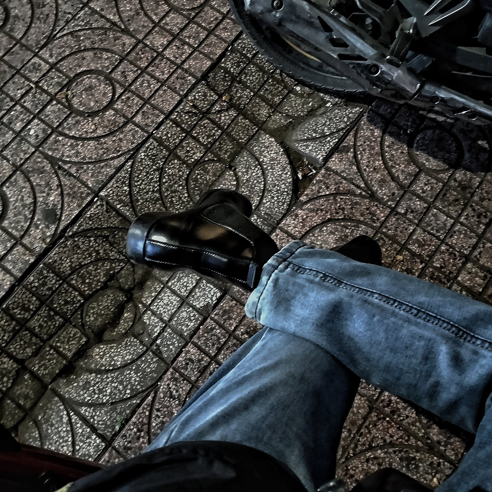

# [🌱 Study with Minh](./posts/study/)

Lorem ipsum dolor sit amet, consectetur adipiscing elit. Sed in ante et quam dictum pulvinar in non diam. Aliquam at lorem sit amet turpis ornare luctus. Nulla rutrum sagittis erat vitae pretium. Praesent consectetur vitae urna eu egestas. Nulla ullamcorper ornare nunc sed euismod. Aenean aliquam magna vel enim hendrerit sollicitudin. Sed tincidunt euismod venenatis. Maecenas a dictum magna. Nunc gravida dignissim libero vel accumsan.

# [🌱 Minh's talks](./posts/talks/)

Aliquam aliquam neque non dolor suscipit, non consequat velit gravida. Cras in cursus nulla. Aliquam consectetur nisi elementum felis pulvinar dignissim. Cras commodo dolor purus, ut consequat mi vulputate vel. Proin eu convallis neque. Aliquam ac elementum sapien. Nam hendrerit convallis tellus, a efficitur odio feugiat at. Mauris placerat erat a metus dictum, ac ultrices velit vestibulum.

<!-- Page styling -->

