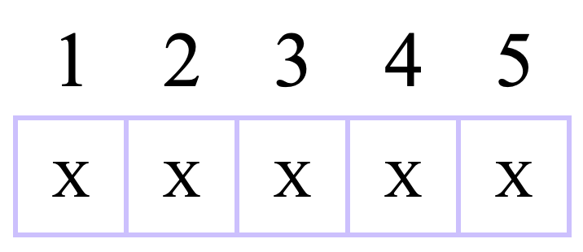
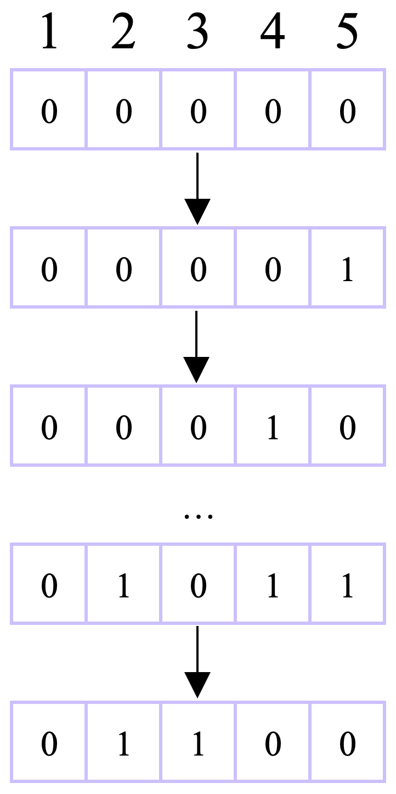
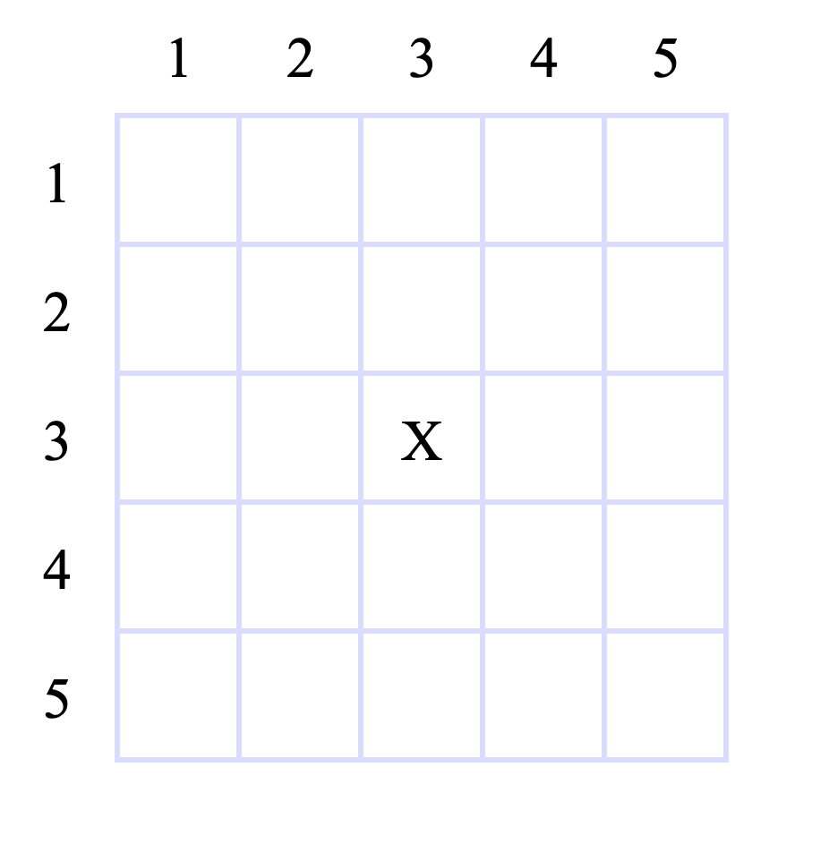
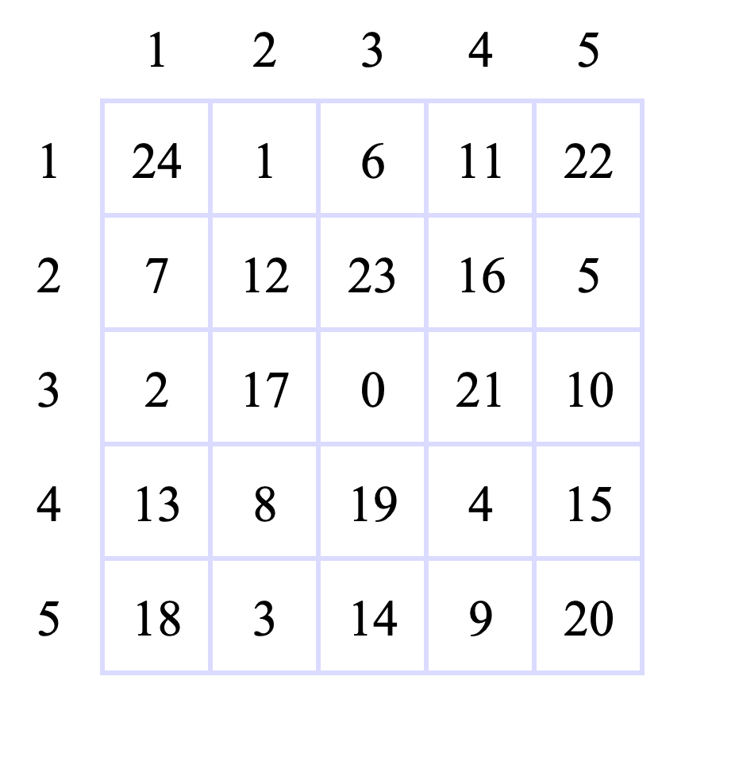
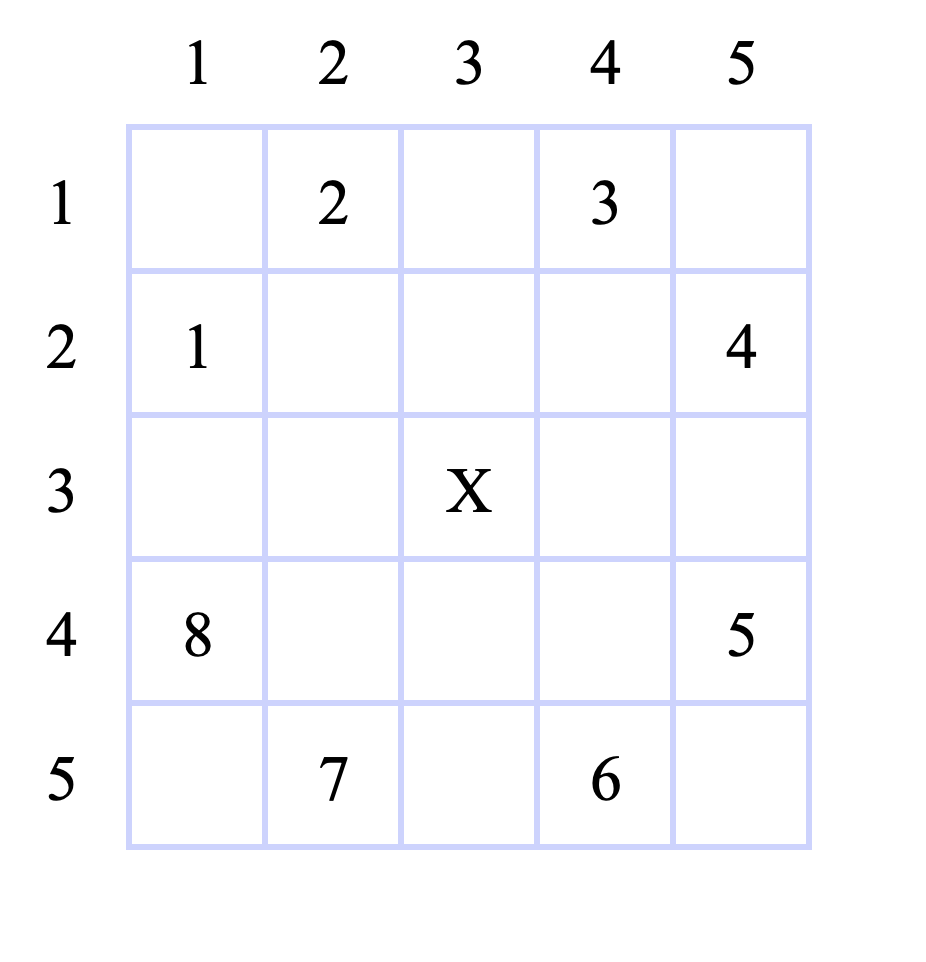

# Recursion & Backtracking Algorithm - Đệ quy & Thuật toán quay lui

> *Some open mind question which I did not come up yet!*

## Recursion - Đệ quy

### Definition - Khái niệm

"Sự đệ quy" hay "Đệ quy" là một khái niệm xuất hiện để chỉ các sự vật có thể **tự định nghĩa chính nó**. Một sự vật có tính chất như vậy được gọi là có "tính đệ quy" (*recursive*) và được xuất hiện ở trong các ngành học từ ngôn ngữ học đến logic. Phổ biến nhất phải nói đến toán học và khoa học máy tính.

Đối với khoa học máy tính, cụm từ đệ quy được sử dụng khi một hàm số tự gọi lại chính nó (*tự định nghĩa chính nó*). Cậu có thể hình dung qua một ví dụ minh họa như sau:

> - Giả sử có một hàm số $f(x) = f(x + 1) + 5$. (*Trông rất giống với toán ở THPT đúng không?*)
> - Câu hỏi đặt ra: Tính giá trị của $f(5)$.
> - Đơn giản thôi, cậu chỉ cần thay $x = 5$ vào trong định nghĩa của $f(x)$ và thực hiện tính toán là được:
>     - Ta có: $f(5) = f(5 + 1) + 5 = f(6) + 5$.
>     - Chà, xuất hiện $f(6)$, vậy thì mình đi tính giá trị của $f(6)$ rồi cộng với $5$ sẽ ra giá trị của $f(5)$.
>     - Ta có: $f(6) = f(6 + 1) + 5 = f(7) + 5$.
>     - Chà, xuất hiện $f(7)$, vậy thì mình đi tính giá trị của $f(7)$ rồi cộng với $5$ sẽ ra giá trị của $f(6)$.
>     - Ta có: $f(7) = f(7 + 1) + 5 = f(8) + 5$.
>     - Chà, xuất hiện $f(8)$, vậy thì mình đi tính giá trị của $f(8)$ rồi cộng với $5$ sẽ ra giá trị của $f(7)$.
>     ...

Nếu cậu tiếp tục phân tích như vậy thì quá trình đó sẽ kéo dài đến vô tận. Cậu thấy rằng, trong ví dụ trên, để tính giá trị của $f(x)$ thì cậu lại cần giá trị của $f(x + 1)$. Hay nói cách khác, **hàm số $f()$ được định nghĩa bởi chính hàm số $f()$ nhưng với một tham số khác**. Đây chính là **sự đệ quy**. Có rất nhiều biến thể và cách định nghĩa khác nhau, nhưng chung quy đều nhắc đến sự tự định nghĩa lại chính sự vật đó.

*Để hiểu hơn về đệ quy trong khoa học máy tính nói chung và lập trình nói riêng, mình sẽ cùng cậu đi qua một số câu hỏi đơn giản tiếp theo đây...*

### Bài toán 1

***Đề bài:*** Cho một số nguyên dương $n$. Tính tổng $n$ nguyên dương đầu tiên.

> *Đọc xong đề bài cậu sẽ tự hỏi: "Ủa? Vì sao lại là bài toán này? Trong mấy tài liệu khác thường nói về số Fibonacci hay là tính giai thừa của n mà???*
>
> *Ngạc nhiên đúng không? Thử đọc qua góc nhìn của mình xem sao?*

**Lời giải** cho bài toán trên vô cùng đơn giản, chỉ một vòng lặp `for` duyệt từ $1$ đến $n$ và cộng dồn vào một biến $ans$ thì cậu đã có được kết quả cần tìm. Hoặc nếu cậu giỏi toán hơn thì sẽ biết có một công thức tính tổng cho dãy số đơn giản này là:

$$ans = \sum\limits_{i = 1}^{n}i = \dfrac{n \times (n + 1)}{2}$$

Rõ ràng có cách tính đơn giản cho bài toán này. Nhưng vì sao mình lại nhắc đến đệ quy? Đó là vì mình muốn nhắc đến vài kiến thức mà cậu đã được "tiếp xúc" qua ở bậc học THPT đó là "quy nạp" và "dãy số".

> *Ủa? Đệ quy và hai cái kiến thức đó liên quan gì đến nhau? Và tớ có hiểu quy nạp là gì đâu???*

Mình sẽ không nhắc lại về "quy nạp" hay "dãy số" là gì nhưng mình cần cậu hiểu đơn giản về dãy số như là một dãy các số $a_0, a_1, a_2, \ldots, a_n, a_{n + 1}, \ldots$. Và trong bài toán trên, cậu được cho một dãy số nguyên dương với $n$ số: $1, 2, 3, 4, \ldots, n - 1, n$. Nghĩa là: $a_0 = 1, a_1 = 2, a_2 = 3, \ldots, a_{n - 1} = n$.

Cách định nghĩa này rất dễ hiểu và tường minh. Nhưng để tổng quát hơn thì mình sẽ áp dụng công thức quy nạp (*hệ thức quy nạp*) vào và có một định nghĩa mới như sau:

$$a_i =
\begin{cases}
0 & , i = 0 \\
a_{i - 1} + 1 & , i \neq 0
\end{cases}
$$

Với cách định nghĩa mới như thế này, cậu có thể thấy được **sự đệ quy** ở trong công thức quy nạp: $a_i = a_{i - 1} + 1$.

Như vậy, đáp án của bài toán chỉ là tính tổng các giá trị $a_i$ với mọi $i \in [0, n - 1]$. *Cậu có thể tham khảo đoạn code tính tổng trên dưới đây*.

***C++:***

```cpp
#include <bits/stdc++.h>

using namespace std;

long long a(int i) {
	if (i == 0) {
		return 1;
	}
	return a(i - 1) + 1;
}

int main() {
	int n;
	cin >> n;
	long long sum = 0;
	for (int i = 0; i < n; ++i) {
		sum += a(i);
	}
	cout << sum << endl;
	return 0;
}
```

***Python:***

```py
def a(i: int):
	if i == 0:
		return 1

	return a(i - 1) + 1


n = int(input())
s = 0
for i in range(0, n):
	s += a(i)

print(s)
```

**Giải thích Code:** Hàm $a()$ nhận một giá trị tham số $i$ là vị trí của số đó trong dãy. Khi $i = 0$ thì $a(i) = 1$. Khi $i \neq 0$ thì $a(i) = a(i - 1) + 1$. Đây là công thức quy nạp (*ở một số nơi có thể gọi là hệ thức quy nạp*) khi được áp dụng vào lập trình.

> *Vậy, mình và cậu đã cùng nhắc lại những kiến thức mình nghĩ là quan trọng liên quan đến **Đệ quy**, giờ mình sẽ đưa cậu sang một bài toán cổ điển hơn.*

### Bài toán 2

***Đề bài:*** Cho một số nguyên dương $n$. Tính $n$ giai thừa.

> Đây rồi, một bài toán kinh điển mà tài liệu nào nói về Đệ quy cũng sẽ nhắc đến. Nhưng ở đây mình sẽ cùng cậu đi qua trình tự khác.

Xét trên phương diện toán học, cậu có thể hiểu phép tính giai thừa (*factorial*) như sau: $n! = 1 \cdot 2 \cdot 3 \cdot \ldots \cdot n$.

Nhưng nếu áp dụng cách nhìn theo hướng quy nạp thì cậu sẽ có một cách hiểu khác như sau:

$$
n! = 
\begin{cases}
1 & , n = 1 \\
n \times (n - 1)! & , n > 1
\end{cases}
$$

***Quy ước:*** $0! = 1$.

Cậu có thể thấy công thức quy nạp như sau: $n! = n \times (n - 1)!$. Và sự đệ quy cũng được xuất hiện khi giá trị của $n!$ được tính thông qua $(n - 1)!$ - một phép tính giai thừa khác.

Khi đưa vào lập trình, mình sẽ thay biến $n$ đơn thuần bằng một hàm $f()$ nhận tham số là một số nguyên dương $x$ và trả về giá trị $x!$ - nghĩa là $f(x) = x!$.

***C++***

```cpp
#include <bits/stdc++.h>

using namespace std;

long long f(long long x) {
	if (x == 1 || x == 0) {
		return 1;
	}
	return x * f(x - 1);
}

int main() {
	long long n;
	cin >> n;
	cout << f(n) << endl;
	return 0;
}
```

***Python***

```py
def f(x: int):
	if x == 0 or x == 1:
		return 1

	return x * f(x - 1)


n = int(input())
print(f(n))
```

**Giải thích Code:** Như đã nói ở trên, hàm $f()$ sẽ nhận một tham số đầu vào là số nguyên dương $x$ và trả về giá trị $x!$. Mình xét hai trường hợp $x = 1$ và $x = 0$ trước vì đây là hai trường hợp đơn giản đã biết trước kết quả của $x!$ là gì, còn với $x > 1$ thì cậu chỉ có thể xác định thông qua công thức quy nạp.

### Bài toán 3

***Đề bài:*** Cho một số nguyên dương $n$. Tính số Fibonacci thứ $n$. Với dãy Fibonacci được định nghĩa như sau:

$$
fib(n) =
\begin{cases}
0 & , n = 0 \\
1 & , n = 1 \\
fib(n - 1) + fib(n - 2) & , n \ge 2
\end{cases}
$$

Đây là cách định nghĩa theo hướng quy nạp của dãy Fibonacci. Cậu dễ thấy rằng $fib(n)$ được định nghĩa bởi hai giá trị $fib(n - 1)$ và $fib(n - 2)$, cũng chính là lí do khiến dãy Fibonacci là một trong những ví dụ điển hình khi nói đến Đệ quy.

Khi cậu đã quen với cách nhìn nhận vấn đề và triển khai lời giải của hai bài toán trên thì với bài toán này cậu cũng có thể triển khai một cách tương tự như sau:

***C++***

```cpp
#include <bits/stdc++.h>

using namespace std;

long long fib(long long n) {
	if (n == 0 || n == 1) {
		return 1;
	}
	return fib(n - 1) + fib(n - 2);
}

int main() {
	long long n;
	cin >> n;
	cout << fib(n) << endl;
	return 0;
}
```

***Python***

```py
def fib(n: int):
	if n == 0 or n == 1:
		return 1

	return fib(n - 1) + fib(n - 2)


n = int(input())
print(fib(n))
```

***Giải thích Code:*** Hàm $fib()$ nhận một tham số duy nhất là số nguyên dương $n$ và trả về số Fibonacci thứ $n$. Vì giá trị của các số Fibonacci về sau sẽ rất lớn nên đối với một số ngôn ngữ lập trình định nghĩa kiểu dữ liệu thì sẽ gặp vấn đề về lưu trữ. Khi đó cậu cần phải xử lí các số lớn này. Vấn đề này cũng xảy ra với các bài toán có giá trị lớn ví dụ như bài toán số $2$ hoặc bài toán số $1$ với yêu cầu giá trị $n$ cỡ $10^{19}$ trở đi.

### Một số lưu ý liên quan đến đệ quy

Khi giải quyết những vấn đề theo hướng đệ quy thì cậu cần phải lưu ý một số vấn đề chính như sau:

- Stack Overflow - Tràn bộ nhớ: Đối với những lời giải theo hướng đệ quy, cụ thể hơn là mỗi lần hàm số tự gọi lại chính nó (*lời gọi đệ quy*) thì máy tính sẽ phải trích một phần trong bộ nhớ máy tính để lưu trữ các dữ liệu đang tính của hàm số trong hiện tại. Sau đó sẽ thực hiện lời gọi đệ quy để thực hiện các tính toán cấn thiết. Sau khi lời gọi đệ quy này được thực hiện xong thì máy tính sẽ quay trở lại với những dữ liệu đang xử lí trước lời gọi đệ quy đó và tiếp tục chương trình.
    ```
    Câu lệnh...

    Lời gọi đệ quy thứ nhất
        Câu lệnh...
        ...
        |-> Lời gọi đệ quy thứ hai
            Câu lệnh...
            ...
            |-> Lời gọi đệ quy thứ ba
                Câu lệnh...
                ...
                |-> Lời gọi đệ quy thứ n...
                Câu lệnh...
                ...
                Kết thúc lời gọi đệ quy thứ ba.
            Câu lệnh...
            ...
            Kết thúc lời gọi đệ quy thứ hai.
        Câu lệnh...
        ...
        Kết thúc lời gọi đệ quy thứ nhất.

    Câu lệnh...
    ```

    Với cách hoạt động như vậy, khi thực hiện quá nhiều lời gọi đệ quy chồng chất thì bộ nhớ máy tính sẽ nhanh chóng bị lấp đầy và dẫn đến việc bị tràn bộ nhớ.

- Xử lí chậm: Như đã đề cập ở trên, khi thực hiện một lời gọi đệ quy mới thì những dữ liệu và thông tin ở trước sẽ phải lưu lại, sau khi thực hiện xong lời gọi đệ quy thì những dữ liệu thông tin đó sẽ được tiếp tục sử dụng. Bởi vì phải lưu lại những dữ liệu và thông tin này nên máy tính phải tốn một khoảng thời gian để lưu trữ chúng. Hơn nữa, khi có một lời gọi đệ quy mới, đồng nghĩa với việc máy tính sẽ thực hiện một lời gọi hàm mới và tùy theo ngôn ngữ lập trình sẽ tốn nhiều thời gian để biên dịch và thực thi.

> *Vậy mình và cậu vừa đi qua những kiến thức cơ bản về đệ quy và ba bài toán dưới góc nhìn và hướng giải theo cách đệ quy.*

## Backtracking Algorithm - Thuật toán quay lui

> *Đối với những bài toán phức tạp mà ta không thể tìm ra một thuật toán tối ưu để giải quyết vì cách duy nhất là đi thử từng lời giải có thể của bài toán. Với cách làm này, ta đảm bảo sẽ tìm ra được mọi lời giải cho bài toán. Song đôi khi ta phải đánh đổi một chút về thời gian...*

### Definition - Định nghĩa

Quay lui (*hay vét cạn*) là một phương pháp hay giải thuật giúp ta tìm ra mọi lời giải **chính xác** có thể của một bài toán bất kì, nhưng đánh đổi lại là thời gian thực thi rất lâu. Đối với con người, việc thử từng trường hợp, kiểm tra từng nghiệm có thể của một bài toán có thể rất lâu và tốn nhiều công sức. Song đối với máy tính thì lại là một câu chuyện khác. Nhờ sự tiến bộ của khoa học và công nghệ thì tốc độ xử lí của máy tính đã được cải thiện và nhanh hơn rất nhiều. Tuy nhiên đây vẫn là một giải thuật không thiên về việc tối ưu thời gian mà thiên về đảm bảo độ chính xác và xác định được mọi lời giải có thể của bài toán.

### Công thức tổng quát

> *Mỗi tài liệu khác nhau sẽ có hoặc không một công thức tổng quát cho giải thuật quay lui. Sau đây là một công thức tổng quát mình đúc kết được trong quá trình học của mình. Cậu có thể tham khảo.*

Giả sử, bài toán có tổng cộng $m$ nghiệm. Cậu cần phải xây dựng đủ $n$ nghiệm (*cấu hình*) này và thực hiện kiểm tra tính đúng sai của chúng. Môi nghiệm có thể có $n$ thành phần và những thành phần này được xây dựng dựa trên một tập hợp mình gọi là các thành phần nghiệm.

Sau đây là mô hình của giải thuật quay lui của mình:

```
Backtracking(i, thành phần nghiệm A, nghiệm X) {
	Với mỗi thành phần nghiệm trong tập A {
		Ghi nhận thành phần thứ i của nghiệm X;
		Nếu đã xây dựng xong nghiệm X {
			Kiểm tra nghiệm X;
		}
		Ngược lại {
			Backtracking(i + 1, thành phần nghiệm A, nghiệm X);
		}
		Hủy bỏ việc ghi nhập thành phần thứ i của nghiệm X;
	}
}
```

Hoặc

```
Backtracking(i, thành phần nghiệm A, nghiệm X) {
	Nếu đã xây dựng xong nghiệm X {
		Kiểm tra nghiệm X;
		return;
	}

	Với mỗi thành phần nghiệm trong tập A {
		Ghi nhận thành phần thứ i của nghiệm X;
		Backtracking(i + 1, thành phần nghiệm A, nghiệm X);
		Hủy bỏ việc ghi nhập thành phần thứ i của nghiệm X;
	}
}
```

Điểm khác biệt giữa hai mô hình chính là vị trí kiểm tra quá trình xây dựng nghiệm. Cá nhân mình thích mô hình thứ hai hơn vì nó tách biệt hai công việc xây dựng nghiệm và kiểm tra nghiệm với nhau, từ đó mình sẽ kiểm soát được giải thuật của mình tốt hơn. Song cậu có thể sử dụng bất cứ mô hình nào cậu muốn vì cả hai không chênh lệch nhau về hiệu năng hay thời gian chạy.

> *Để dễ hình dung hơn thì mình sẽ cùng cậu đi qua một vài bài toán kinh điển để tìm cách áp dụng những mô hình này nha.*

### Bài toán 4

***Đề bài:*** Dãy nhị phân độ dài $n$ là một dãy có $n$ phần tử chỉ gồm các số $0$ hoặc $1$. Hãy liệt kê tất cả các dãy nhị phân độ dài $n$ theo thứ tự từ điển.

Ví dụ với $n = 3$ thì ta có $8$ dãy nhị phân sau: `000, 001, 010, 011, 100, 101, 110, 111`.

> *Đây là một bài toán kinh điển trong lập trình khi nhắc đến đệ quy. Cậu hãy thử suy nghĩ một chút trước khi đọc tiếp phần lời giải nha.*

***Giải thuật:*** Mình sẽ hướng dẫn cậu thiết kế một giải thuật dựa trên mô hình thứ hai ở trên. Trước tiên cậu cần xác định được những thành phần sau:

- Tập nghiệm $X$: là một dãy có độ dài $n$ được xây dựng từ các số $0$ hoặc $1$.
- Tập các thành phần nghiệm $A$: là một tập hợp các giá trị giúp tạo nên tập nghiệm $X$. Trong ví dụ này thì $A$ có hai phần tử là $0$ và $1$.
- Điểm dừng của giải thuật: Vì bài toán chỉ yêu cầu liệt kê tất cả các nghiệm có thể (*nghĩa là liệt kê tất cả các dãy nhị phân*). Vì vậy nên ở ví dụ này sẽ không có quá trình kiểm tra nghiệm (*nghĩa là mọi nghiệm tìm được luôn đúng*). Việc cần chú ý duy nhất chính là việc sắp xếp các nghiệm theo thứ tự từ điển.

Ví dụ với $n = 5$ thì cậu có nghiệm $X$ như sau:



Vì dãy nhị phân có độ dài $5$ nên mỗi nghiệm $X$ sẽ có $5$ phần tử và ta sẽ lần lượt điền các số $0$ và $1$ vào từng vị trí mỗi khi cả $5$ ô được điền thì khi đó một nghiệm $X$ đã được xây dựng xong. Quá trình này sẽ được lặp đi lặp lại cho đến khi xây dựng đủ tất cả các nghiệm có thể.

Để đảm bảo được các nghiệm tìm được sẽ được sắp xếp theo thứ tự từ điển thì ta sẽ lần lượt thay thế các số $0$ và $1$ vào các vị trí từ cuối đến đầu của nghiệm $X$ với mỗi lần số $1$ được thay vào thì các vị trí sau đó sẽ được thay bằng những số $0$.

Một cách hiểu khác cho quá trình này như sau: Nghiệm đầu tiên thỏa mãn yêu cầu bài toán và nhỏ nhất chính là một dãy toàn các số $0$. Khi đó, nếu cậu xem đây là một số nhị phân có $n$ bit $0$ thì nghiệm tiếp theo cần tìm chính là nghiệm hiện tại cộng thêm $1$ (cộng theo quy tắc cộng số nhị phân). Nghiệm cuối cùng chính là nghiệm $X$ với $n$ bit $1$.



***Mã giả:***

```
backtracking(i, A, X) {
	Nếu xây được nghiệm X {
		in ra màn hình nghiệm X
		return;
	}
	Với i lần lượt bằng 0 và 1 {
		Ghi nhận thành phần thứ i của nghiệm X;
		backtracking(i + 1, A, X);
		Hủy bỏ ghi nhận thành phần thứ i; 
	}
}
```

> *Cậu hãy thử dựa trên mã giả trên để áp dụng vào ngôn ngữ lập trình cậu sử dụng trước khi xem code mẫu gợi ý của mình nha.*

***C++***

```cpp
#include <bits/stdc++.h>

using namespace std;

void backtracking(const int n, int index, int*& x) {
	if (index == n) {
		for (int i = 0; i < n; ++i) {
			cout << x[i];
		}
		cout << "\n";
		return;
	}
	for (int i = 0; i <= 1; ++i) {
		x[index] = i;
		backtracking(n, index + 1, x);
	}
}

int main() {
	int n;
	cin >> n;
	int* x = new int [n];
	backtracking(n, 0, x);
	delete[] x;
	return 0;
}
```

***Python***

```py
def backtracking(n: int, index: int, x: list):
	if index == n:
		print("".join(map(str, x)))
	else:
		for i in range(0, 2):
			x[index] = i
			backtracking(n, index + 1, x)


n = int(input())
x = [0 for i in range(0, n)]
backtracking(n, 0, x)
```

***Giải thích code:*** Hàm $backtracking()$ nhận $3$ tham số đầu vào: `n, index` và mảng `x`. Trong đó `n` và `index` lần lượt là số lượng phần tử của dãy nhị phân và chỉ số xác định thứ tự của thành phần nghiệm đang xây dựng hiện tại. Mảng `x` được sử dụng làm đại diện cho nghiệm $X$ và vì ta đã xác định được các thành phần nghiệm gồm hai số $0$ và $1$ nên không cần tập các thành phần nghiệm $A$ mà chỉ cần sử dụng vòng lặp `for`.

***Độ phức tạp thời gian:*** Ta thấy có mỗi thành phần của nghiệm $X$ có thể nhận hai giá trị $0$ và $1$. Như vậy tổng số lượng nghiệm $X$ có thể xây dựng được sẽ là $2^n$ (*theo công thức nhân*). Do vậy, độ phức tạp thời gian của giải thuật là $O(2^n)$.

<!-- TODO: Hoàn thành bài toán 5 -->

<!-- ### Bài toán 5

***Đề bài:*** Cho một bàn cờ vua kích thước $5 \times 5$ và quân mã được đặt ở ô có vị trí `(x, y)`. Hãy đếm số lượng lộ trình đi của quân mã sao cho quân mã sẽ đi hết bàn cờ và mỗi ô chỉ được đi không quá một lần.

> *Đây là một bài toán kinh điển và có nhiều lời giải khác nhau. Bên cạnh đó đây cũng là một bài toán thường thấy khi nhắc đến giải thuật quay lui.*



Giả sử quân mã được đặt ở vị trí `(3, 3)` như hình vẽ, thì một trong những lộ trình đi của quân mã như sau:



Ô xuất phát sẽ được đánh số $0$, các ô tiếp theo sẽ được đánh số $1, 2, 3, \ldots , 24$.

Đây là một trong nhiều lộ trình có thể. Yêu cầu bài toán là đếm số lượng lộ trình như thế này.

> *Cậu hãy thử suy nghĩ và làm thử trước khi đọc phần tiếp theo nha.*

***Giải thuật:*** Như mình đã nói, đây là một bài toán có nhiều giải thuật. Mình sẽ gợi ý cho cậu giải thuật như sau:

- Tập nghiệm $X$ của đề bài chính là tập các lộ trình như mô tả của quân mã. Mỗi nghiệm $x$ sẽ là một lộ trình thỏa mãn yêu cầu đề bài (ở hình vẽ trên cũng là một nghiệm $x$ đúng).
- Tập thành phần nghiệm $A$: là các vị trí có thể đi đến của quân mã từ vị trí hiện tại.



Từ vị trí `X` thì quân mã có thể đi đến các ô đánh số từ $1$ đến $8$.

***Mã giả***

```
backtracking(i, A, X) {
	Nếu đã xây dựng xong nghiệm X {
		Kiểm tra lộ trình;
		return;
	}
	Ngược lại {
		Với mỗi bước đi có thể của quân mã {
			Thử nước đi;
			backtracking(i + 1, A, X);
			Hủy bước đi;
		}
	}
}
```

Trong khi xây dựng nghiệm $x$ hiện tại, các thành phần nghiệm sẽ là vị trí di chuyển (có thể) của quân mã (xét ở vị trí hiện tại). Phép ghi nhận thành phần nghiệm $i$ hiện tại chỉ ghi nhận đối với những ô trên bàn cờ mà quân mã chưa đi qua. Do vậy mã nghiệm $x$ sẽ được xây dựng xong khi tất cả các ô trên bàn cờ đã được điền kín. Và khi đó nghiệm $x$ tìm được sẽ là một nghiệm đúng.

***C++***

```cpp
#include <bits/stdc++.h>

using namespace std;

#define SIZE 5

const int dx[8] = {-1, -2, -2, -1, +1, +2, +2, +1};
const int dy[8] = {-2, -1, +1, +2, +2, +1, -1, -2};

bool inside(int x, int y) {
	return (0 <= x && x < SIZE && 0 <= y && y < SIZE);
}

int chess[SIZE][SIZE];

void reset() {
	for (int i = 0; i < SIZE; ++i) {
		for (int j = 0; j < SIZE; ++j) {
			chess[i][j] = -1;
		}
	}
}

void print() {
    cout << "---\n";
	for (int i = 0; i < SIZE; ++i) {
		for (int j = 0; j < SIZE; ++j) {
			cout << setw(2) << chess[i][j] << (j < SIZE - 1 ? " " : "\n");
		}
	}
}

void backTracking(int x, int y, int step, int& counter) {
	chess[x][y] = step;
	if (step == SIZE * SIZE - 1) {
		print();
		++counter;
	}
	else {
		for (int k = 0; k < 8; ++k) {
			int new_x = x + dx[k];
			int new_y = y + dy[k];
			if (inside(new_x, new_y) && chess[new_x][new_y] == -1) {
				backTracking(new_x, new_y, step + 1, counter);
                chess[new_x][new_y] = -1;
			}
		}
	}
}

int main() {
    int counter = 0;
	for (int i = 0; i < SIZE; ++i) {
		for (int j = 0; j < SIZE; ++j) {
			reset();
			backTracking(i, j, 0, counter);
		}
	}
	cout << "---\n";
	cout << "Number of traversal: " << counter << endl;
    return 0;
}
```

***Python***

```py
``` -->


## Tài liệu tham khảo

- [Introduction to Recursion | GeeksforGeeks](https://www.geeksforgeeks.org/introduction-to-recursion-data-structure-and-algorithm-tutorials/).
- [Recursion | Wikipedia](https://en.wikipedia.org/wiki/Recursion).
- [Python Recursion | Progammingiz](https://www.programiz.com/python-programming/recursion).


