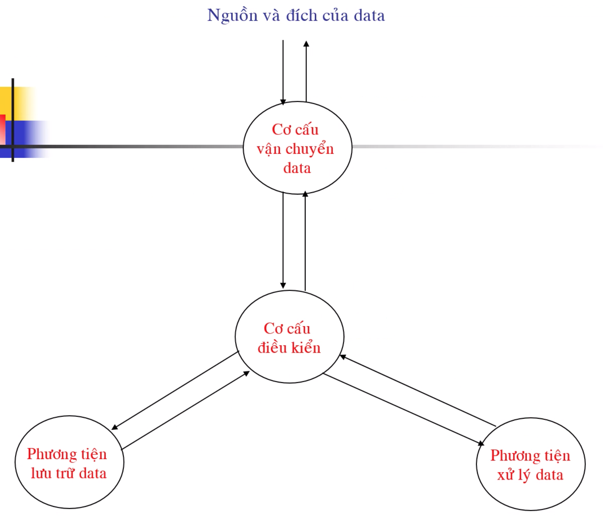
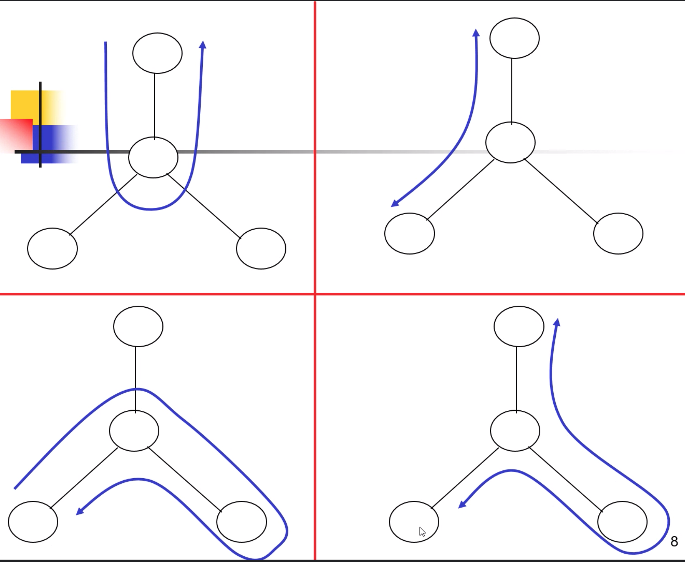
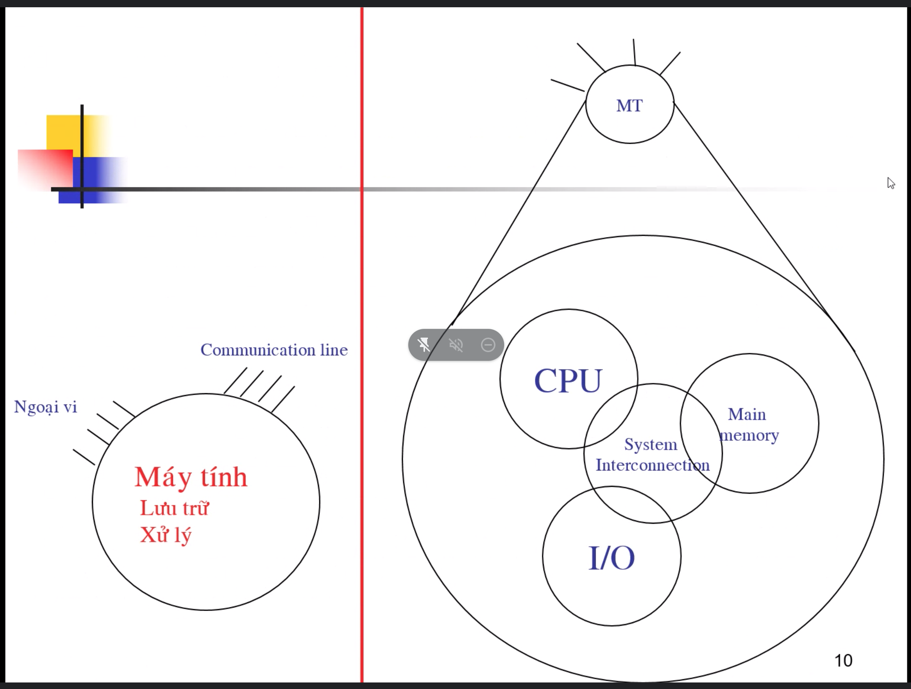
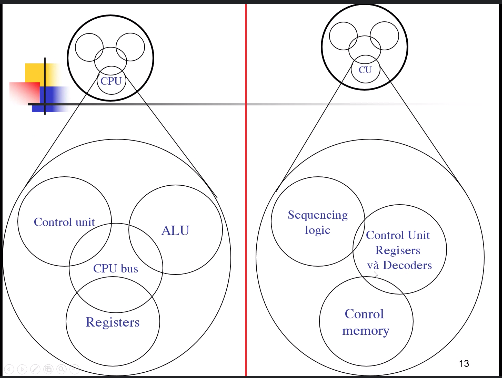

# Kiến trúc máy tính

> *Thầy: Nguyễn Hồng Sơn.*
> *STD: 0913717505*

---

- [Kiến thức chung](#-kiến-thức-chung-)
    - [Tổ chức và kiến trúc](#-tổ-chức-và-kiến-trúc-)
    - [Cấu trúc và chức năng:](#-cấu-trúc-và-chức-năng-)
    - [Chức năng của máy tính](#-chức-năng-của-máy-tính-)
    - [Các thành phần chính](#-các-thành-phần-chính-)
    - [Sơ lược về lịch sử phát triển](#-sơ-lược-về-lịch-sử-phát-triển-)
- [References](#-references-)

---

## Kiến thức chung

### Tổ chức và kiến trúc

Hai thuật ngữ dùng để mô tả hệ thống máy tính.

- Kiến trúc đề cập đến các **thuộc tính** mà người lập trình nhận thấy được, **ảnh hưởng trực tiếp đến thực thi chương trình** (Introduction set, số bit biểu diễn data type, cơ cấu I/O, addressing).
- Tổ chức máy tính đề cập đến các **đơn vị hoạt động và sự liên kết của chúng**, thực hiện các đặt tả kiến trúc (chi tiết phần cứng, control signal, interfaces, memory technology).
- Ví dụ multiply instruction.

### Cấu trúc và chức năng:

- Cấu trúc: cách thức các thành phần hệ thống liên hệ với nhau. 
- Chức năng: hoạt động của mỗi thành phần riêng lẻ với tư cách là một phần của cấu trúc.

### Chức năng của máy tính

- Data processing
- Data storage
- Data movement (I/O, peripheral, comunication)
- Control

*(Bốn chức năng cần thiết của một máy tính)*

***Mô hình hoạt động của máy tính:***

***Luồng hoạt độc thực tế của máy tính (dựa trên mô hình hoạt động):***

### Các thành phần chính

- CPU: Điều khiển các hoạt động và thực hiện các chức năng xử lí data (**cơ cấu điều khiển, phương tiện xử lí data**).
- Main memory: Lưu trữ data (**phương tiện lưu trữ data**).
- I/O: Vận chuyển data với máy tính bên ngoài (**cơ cấu vận chuyển data**).
- System Interconnection: Cung cấp cơ chế truyền thông giữa các thành phần trên (**mũi tên nối các thành phần trên**).

***Tổng quan về máy tính:***

 

**Thành phần phức tạp nhất là CPU:**

- Control unit.
- ALU (Arithmetic and Logic Unit)
- Register.
- CPU Interconnection.

***CPU:***

 

### Sơ lược về lịch sử phát triển

- Thế hệ thứ nhất:

    - Đèn chân không (vacuum tubes).
    - ENIAC
    - John Von Neumann/Alan Turing.

- Thế hệ thứ hai:

    - Transistor.
    - Multiplexer.
    - Lập trình mức cao.
    - Phần mềm hệ thống.

- Thế hệ thứ ba:

    - Mạch tích hợp (Intergrated circuits):

        - SSI, MSI.
        - Microelectronics.
        - IBM/360, PDP - 8 (minicomputer đầu tiên, dùng bus).
        - Luật Moore.

- Thế hệ thứ tư:

    - LSI, VLSI, ULSI.

- Các thế hệ sau...

---

## 

---

## References

- [Computer organization & architecture - design for performance, William Stalling, 10th edition, Prentice-Hall International, Inc]
- [Principle of computer architecture, Miles Murdocca & Vincent Heuring]

