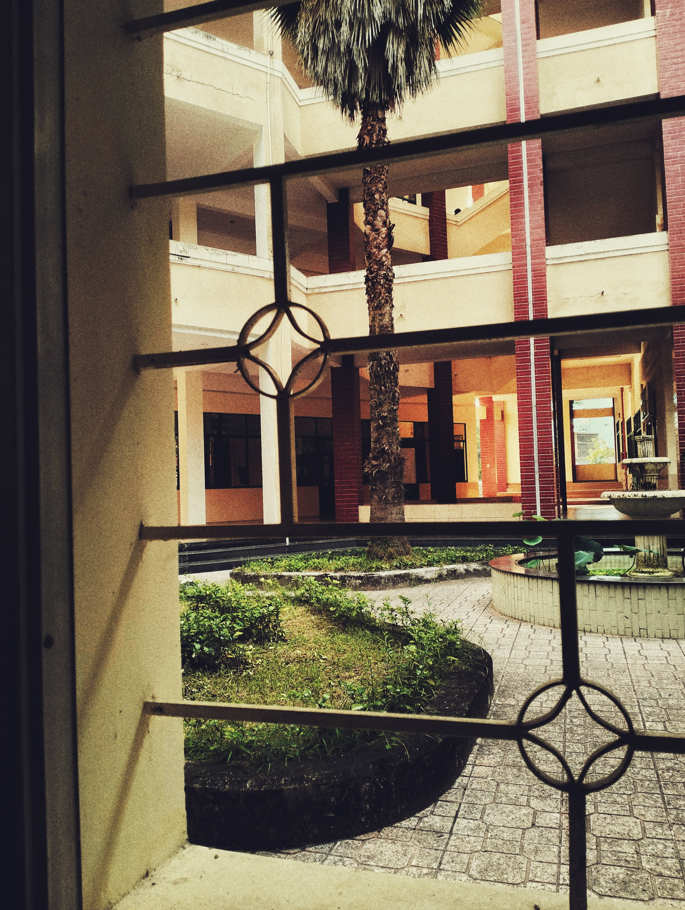

# Lí do sống của cậu là gì?

> *Sài Gòn | 1/11/2022*

Con người tuy khác nhau nhưng xét cho cùng thì đều được đưa đến thế giới này với cùng một phương thức. Điều phân biệt chúng ta với nhau chính là cách ta định nghĩa bản thân. Vậy, cậu sống vì lí do gì? Vì sao hôm qua cậu sẽ chọn hôm nay cậu sẽ sống? Ngày mai cậu sẽ chọn sống tiếp hay là chết đi?... Vì sợ chết? Vì mong muốn được nhìn thế giới tiếp tục xoay vòng? Hay vì điều gì?...

Cậu có một giá trị gì đó đối với thế giới méo mó này. Dù rằng đó là giá trị tích cực hay là tiêu cực. Dù cho khả năng tác động của cậu đến với thế giới này lớn hay nhỏ. Thì mình muốn cậu hãy sống có ý nghĩa. Đừng để cơ hội được sống của ngày hôm nay trôi qua phí phạm. Nếu ngày mai cậu sẽ chết, hay tận hưởng cái chết sau khi sống một cuộc đời ý nghĩa tối thiểu nhất là cho cậu và nhiều hơn là cho người khác.

Cười. Chúc cậu có một ngày ý nghĩa.

